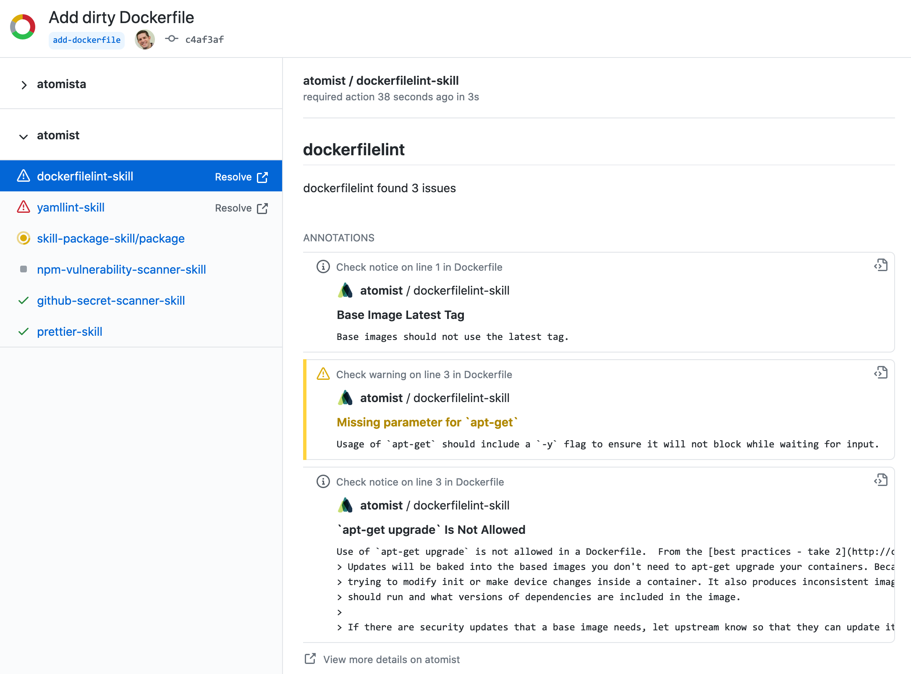

Find problems in and get consistency across your Dockerfiles.

-   Run [dockerfilelint](https://github.com/replicatedhq/dockerfilelint) with
    the same consistent configuration across all of your projects
-   Also supports repository-specific dockerfilelint configurations
-   Uses GitHub commit checks with code-level annotations for linting violations

### Commit check

