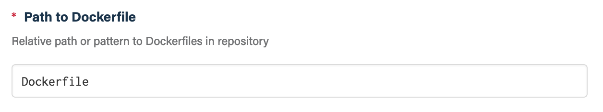
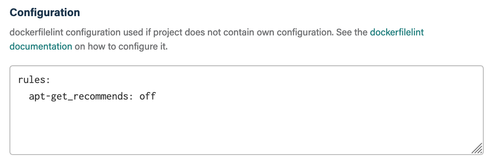

## Before you get started

Connect and configure these integrations:

1.  [**GitHub**](https://go.atomist.com/catalog/integration/github "GitHub Integration")
    _(required)_

## How to configure

1.  **Configure path to Dockerfile**

    

    Provide a relative path or pattern to your Dockerfiles in the repository.

1.  **Specify an optional dockerfilelint configuration**

    

    Provide the
    [dockerfilelint configuration](https://github.com/replicatedhq/dockerfilelint#configuring)
    to be used for linting when a repository does not have its own
    configuration.

1.  **Determine repository scope**

    

    By default, this skill will be enabled for all repositories in all
    organizations you have connected.

    To restrict the organizations or specific repositories on which the skill
    will run, you can explicitly choose organizations and repositories.

1.  **Activate the skill**

    Save your configuration and activate the skill by clicking the "Enable
    skill" button.
